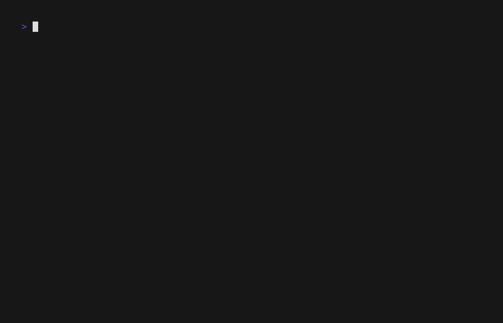

# pi-vimux-starship

A Vim- and tmux-inspired command deck for
[Pi](https://pi.dev): lifecycle context, external-Neovim prompt
composition, Vim command handling, and responsive operational telemetry in one package.



> [!IMPORTANT]
> The best experience is **Pi in regular mode inside `nvim +terminal`**, with a blocking
> Neovim bridge configured as Pi's `externalEditor`. Pi fullscreen reserves a three-row
> editor slot and is not the target layout.

## The cockpit

```text
Header Deck ◀── bounded lifecycle, work, project, model, and resource context
    │
    └── bottom separator ◀── live Vim Normal / Visual / EX / Insert feedback

zero-row Vim command surface ── Insert transition ──▶ Neovim prompt.md
                             ◀── :x + auto-submit ───┘

responsive Footer ◀── model, quota, context, cost, Git, and capability telemetry
```

The package composes four bounded modules in dependency-safe order:

- **Fancy Footer** — responsive model, quota, context, cost, Git, and resource telemetry;
- **Status provider** — lifecycle, OpenSpec, Session Work, and diagnostic state;
- **Header Deck** — current activity, focus, project state, and compact telemetry;
- **Pi Vim** — hidden-draft Normal/Visual/EX commands and external-editor handoff.

Optional Git, OpenSpec, Devbox, tmux, Neovim, provider-quota, and Nerd Font capabilities
fail soft when absent. Pi core remains the API authority.

## Recommended setup

### Requirements

- Node.js 24 or newer;
- a current Pi installation;
- Neovim for the recommended workflow;
- one blocking `externalEditor` executable that accepts the temporary Markdown file as
  its only argument, opens it in the enclosing Neovim instance, and exits when that
  buffer closes.

The bridge is deliberately not shipped: connecting to a private Neovim server is
machine-specific and belongs in your trusted user configuration.

Configure the bridge through Pi's global `~/.pi/agent/settings.json` or `/settings`:

```json
{
  "externalEditor": "/absolute/path/to/your/blocking-nvim-bridge"
}
```

The current adapter invokes that setting as one executable without a shell. Put arguments
inside your bridge script rather than appending shell text to `externalEditor`.

Start Neovim, open a terminal, and run Pi in regular mode:

```vim
:terminal
```

```bash
pi --tui-mode regular
```

### Optional Ctrl-E mapping

Current Pi defaults `app.editor.external` to Ctrl-G. The validated cockpit uses Ctrl-E;
this remains your user-owned Pi configuration:

```json
{
  "app.editor.external": "ctrl+e"
}
```

Place that in `~/.pi/agent/keybindings.json`, then run `/reload`. The package never edits
Pi or Neovim configuration automatically.

## Prompt workflow

The consolidated surface starts in Normal and renders zero native prompt rows.

1. Press `i`, `a`, `I`, `A`, `o`, `O`, `s`, `S`, `C`, a supported change command, or
   Pi's configured external-editor shortcut.
2. The Header Deck shows Insert while Neovim owns the handoff.
3. Compose in the temporary `prompt.md` buffer.
4. Use `:x` or `:wq` after writing to return and submit exactly once.

Submission follows the last explicit write—not a content comparison:

- edited `:x` or `:wq` submits;
- unchanged `:x` that performs no write submits nothing;
- `:q!` without a write submits nothing;
- `:w`, further unsaved edits, then `:q!` submits the last saved bytes;
- failed, inactive, and duplicate handoffs never submit.

Normal, Visual, and EX commands still operate on the hidden draft. Ordinary terminal
scrollback navigation and text selection belong to the enclosing Neovim terminal buffer.
Restoring outer Neovim's terminal Insert state after the prompt closes also remains
Neovim configuration.

## Health check

Run the read-only health report directly:

```text
/vimux-health
```

Or through the exact Pi EX-command bridge from Normal mode:

```vim
:vimux-health
```

The bounded report classifies package registration, interactive TUI, external-editor
readiness, recommended Neovim topology, and optional local capabilities as `PASS`,
`WARN`, or `INFO`. It does not execute the configured editor or expose commands,
settings, endpoints, environment values, credentials, or absolute paths.

## Installation

This project is currently private and `UNLICENSED`; npm publication is not authorized.
Review extensions before installation because Pi packages execute with user permissions.

### Local path

From the repository root:

```bash
npm ci
npm run check
pi install "$(pwd -P)"
```

Do not load this package alongside the four legacy component package entries. Inspect
`pi list`, then remove or disable duplicates as one reviewed user action. `npm link` is
not Pi's package-registration mechanism.

### Pinned private Git source

After the repository has an authorized remote, install an immutable tag or commit:

```bash
pi install git:<host>/<owner>/pi-vimux-starship@<tag-or-commit>
```

A pinned ref does not move during ordinary package updates. Network access, credentials,
remote publication, and pushing are outside this repository's automated checks.

### Rollback

Keep the previous source/ref before changing installation. To remove this package:

```bash
pi remove /absolute/path/to/pi-vimux-starship
```

For Git installations, pass the same `git:` package identity used during installation.
Restore the previous package entries only after confirming this package has been removed;
never keep both cockpit registrations active.

## Reproducible VHS demo

The checked-in tape is a header-led, credential-free demonstration. It hides routine
startup, applies one ephemeral no-session title, then invokes `:vimux-health` through Pi
Vim's Normal-mode EX bridge rather than sending a provider prompt. It runs Pi directly
and requires no private Neovim bridge. From the repository root, run:

```bash
vhs demo/pi-vimux-starship.tape
```

It writes `docs/assets/pi-vimux-starship.gif` using VHS's explicit Gruvbox Light terminal
theme and a compact frame that keeps the cockpit prominent. Review the entire recording
for private paths, notifications, or terminal history before committing it. The single
reviewed GIF is the project's explicit demo-asset exception; ordinary screenshots and
private runtime captures remain excluded.

## Development

```bash
npm run check:package
npm run check:package:load
npm run check
```

The package gate constrains shipped paths, creates real tarballs only under temporary
ignored directories, extracts them, and loads them through credential-free offline Pi.
It never initializes another Git/Rustory repository or mutates Pi settings.

See:

- [`docs/architecture.md`](docs/architecture.md) — package and privacy boundaries;
- [`docs/development.md`](docs/development.md) — focused checks and local development;
- [`licenses/README.md`](licenses/README.md) — upstream licenses and provenance;
- [`packages/pi-vim-top-border/README.md`](packages/pi-vim-top-border/README.md) — complete
  Vim command reference.
